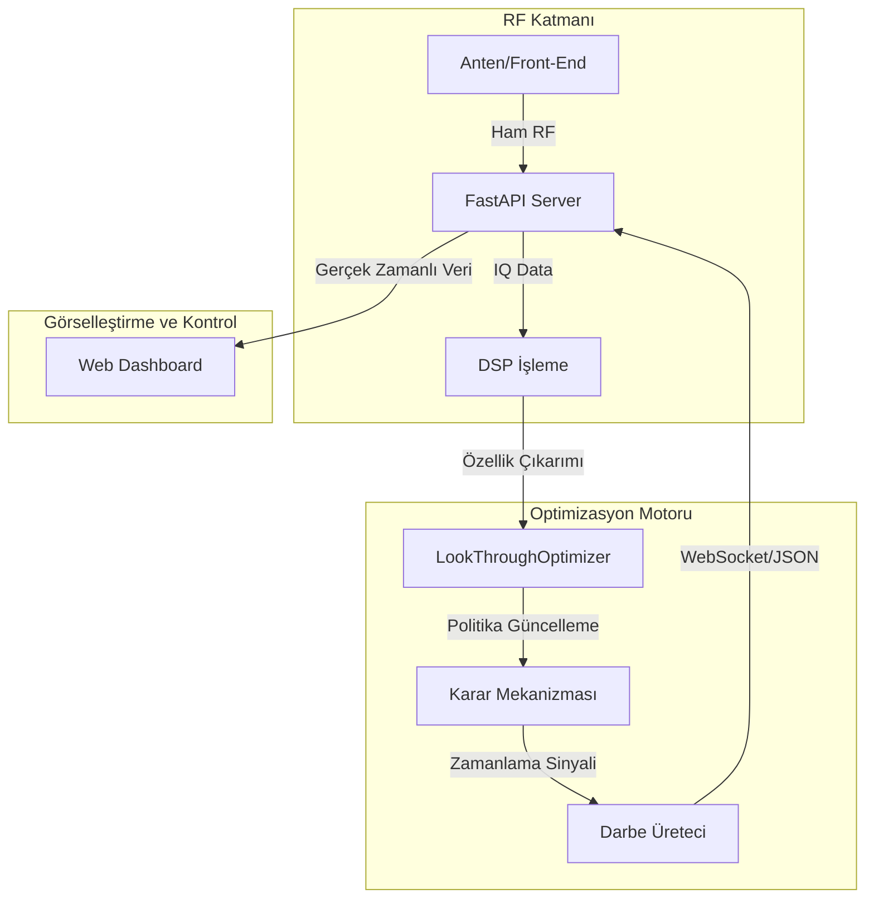

# 🛡️ Akıllı Look-Through Optimizatörü (SLT-X) - Teknik Spesifikasyon

> **Yüksek Yoğunluklu RF Ortamlarında Adaptif EH Zamanlama ve İzleme Optimizasyonu Modeli.**

## 🌌 1. Teorik Altyapı ve Fiziksel Modelleme

SLT-X, Elektronik Harp (EH) literatüründe "Zaman Paylaşımlı Alıcı-Verici Yönetimi" (Time-Shared Transceiver Management) olarak bilinen problemin optimizasyonuna odaklanır. Bir dijital frekans hafızalı (DRFM) karıştırıcı sisteminin, etkin yayını sürdürürken aynı anda spektral farkındalık kazanması için gereken "Look-Through" pencerelerini dinamik olarak yönetir.

### 1.1 Sinyal Yayılım ve Kayıp Analizi
Sistem, sinyal bütçesini (Link Budget) anlık olarak hesaplarken Friis denklemini baz alan modifiye edilmiş bir serbest uzay yol kaybı modeli (FSPL) kullanır:
$$L = 20 \log_{10}(d) + 20 \log_{10}(f) - 147.55 + A_{loss}$$
Burada $d$ mesafe (km), $f$ ise frekanstır (Hz). $A_{loss}$ atmosferik ve çevresel sönümlenme katsayısını temsil eder.

### 1.2 SNR Karar Matrisi ve Karıştırma Marjı
Hedef radarın tespit olasılığını ($P_d$) en aza indirmek için gereken karıştırma-sinyal oranı ($J/S$) sürekli analiz edilir. Efektif SNR hesaplaması:
$$SNR_{eff} = |P_{target} - (N_{floor} + J_{gain} - L_{path})|$$
Look-Through zamanlaması, hedefin bu $SNR$ değerini kompanse ederek takip (tracking) kurma kapasitesini kırmak üzerine kuruludur.

## 📐 2. Adaptif Optimizasyon Algoritması

Sistemin kalbinde yer alan `LookThroughOptimizer`, çok değişkenli bir karar matrisi üzerinden çalışır.

### 2.1 Zamanlama Parametreleri (PW ve RI)
Zamanlama, iki temel kontrol değişkenine dayanır:
- **Darbe Genişliği (Pulse Width - $PW_{LT}$):** Alıcının spektral örnekleme yapacağı pencerenin süresi.
- **Tekrar Aralığı (Repeat Interval - $RI_{LT}$):** İki LT penceresi arasındaki RF yayın süresi.

### 2.2 Dinamik Ölçeklendirme Fonksiyonları
Sistem, tehditlerin dinamik risk skoruna ($\tau$) göre parametreleri şu fonksiyonlarla optimize eder:
$$\tau = \sum_{i=1}^{n} (w_i \cdot v_i + p_i)$$
Burada $w_i$ tehdit ağırlığı, $v_i$ hız ve $p_i$ tehdit tipine (örn: Atış Kontrol Radarı) bağlı öncelik katsayısıdır.

- **Agresif Mod ($RI_{min}$):** $\tau > \tau_{threshold}$ ise $RI$ değeri %50 oranında daraltılır.
- **Stabil Mod ($RI_{nom}$):** $\tau < \tau_{threshold}$ ise spektral temizlik için PW değeri maksimize edilir.

### 2.3 Q-Learning AI Modülü
Sistem, statik kuralların ötesinde, `core/q_learning.py` üzerinden bir RL (Pekiştirmeli Öğrenme) ajanı kullanır. Ajan, PW ve RI değerlerini SNR geri beslemesi ve tehdit yoğunluğuna göre optimize ederek en yüksek EH etkinliğini hedefler.

## 🛠️ 3. Sistem Mimarisi (Architectural Overview)

## 🚀 4. Yazılım Bileşenleri ve Teknik Metotlar

### 4.1 'core/optimizer.py' - Fiziksel Motor
- **Numpy Entegrasyonu:** Vektörel hesaplamalar ile $O(1)$ zaman karmaşıklığında anlık karar verme.
- **Çoklu Tehdit Önceliklendirme:** Search, SAR ve FireControl radarları için farklılaşmış risk profilleri.

### 4.2 'core/simulator.py' - Stratejik Simülatör
- **Sentetik Senaryo Üretimi:** Doppler kayması ve değişken yaklaşma hızlı tehditlerin simüle edilmesi.
- **Fail-Safe Mekanizması:** Kritik hata durumlarında '10/500' pasif izleme moduna otomatik geçiş.

### 4.3 'gui/' - Gerçek Zamanlı Analiz Konsolu
- **WebSocket Entegrasyonu:** `server.py` üzerinden gelen canlı verileri işleyen dinamik HUD.
- **60 FPS Canvas Rendering:** Yüksek frekanslı sinyal spektrogram görselleştirmesi.
- **Auto-Fallback Simülasyonu:** Sunucu çevrimdışı olduğunda otomatik olarak yerel simülasyon moduna geçiş.

## 🚦 5. Teknik Spesifikasyonlar ve Gereksinimler

- **Runtime:** Python 3.9+ (C-Python Interpreter önerilir).
- **CPU:** Sabit frekans ve düşük gecikme için gerçek zamanlı önceliklendirme desteği.
- **Gereksinimler:** \`numpy >= 1.20.0\` kütüphanesi.

---

*Teknik Not: Bu sistem, ECM (Elektronik Karşı Tedbir) stratejilerini optimize etmek için geliştirilmiş teorik bir modeldir.*
